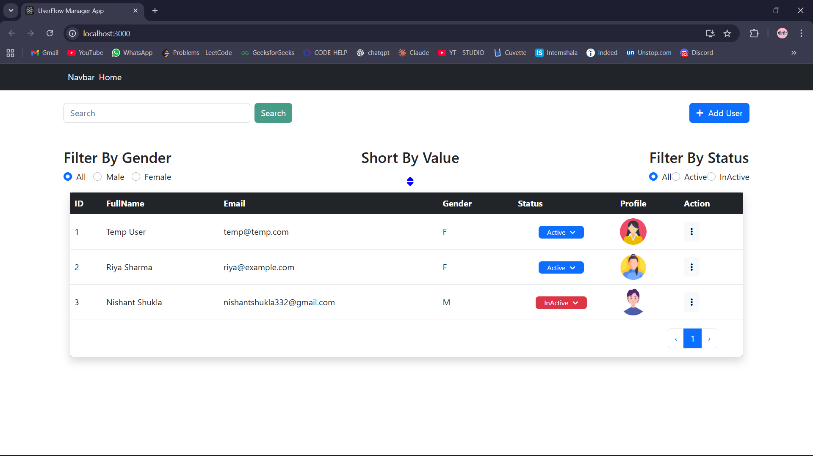
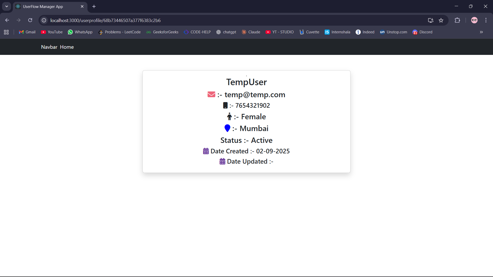
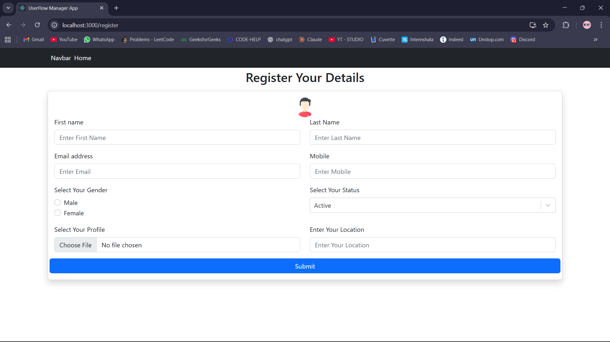
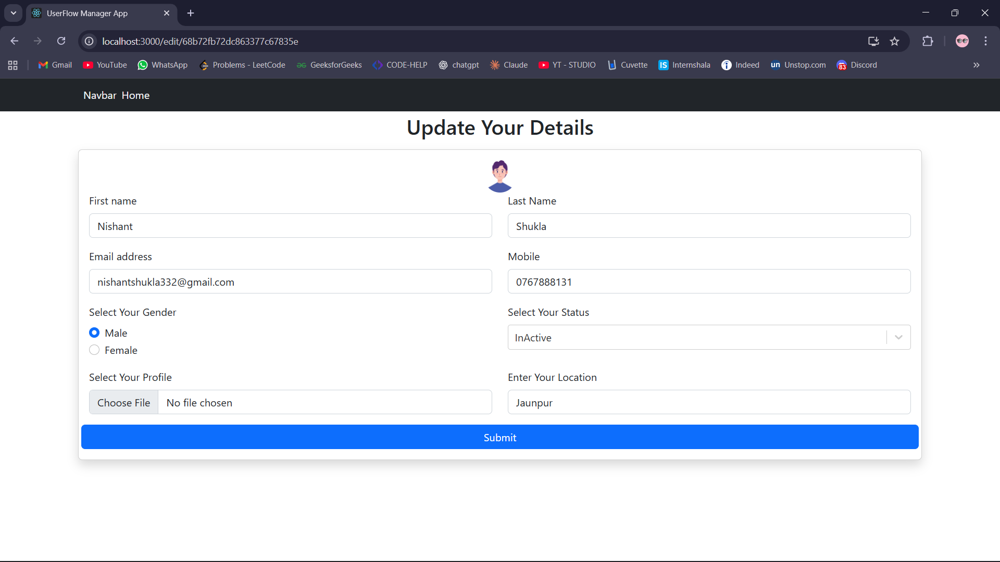
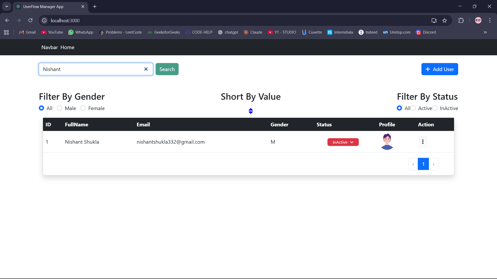
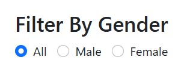
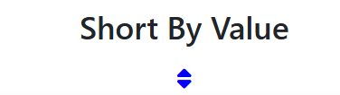
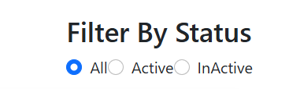

# 🌐 Userflow Manager App

A **MERN stack application** for managing users with full CRUD functionality, real-time data updates, and advanced filtering and search capabilities.

## Features

Userflow Manager allows administrators to efficiently manage users with:

- Add, edit, delete, and view users in detail.  
- Toggle user status between **active** and **inactive**.
- Upload images using Cloudinary
- Dynamic **filters** (gender, status), **sorting**, **pagination**, and **search**.  
- Seamless integration of **React frontend** with **Express & MongoDB backend** for real-time data management.


## Tech Stack  
- **Frontend:** React
- **Backend:** Node.js, Express.js
- **Database:** MongoDB (via Mongoose)
- **File Storage:** Cloudinary
- **State Management:** Context
- **Styling:** Bootstrap, CSS
- **UI Enhancements:** React Icons, React Toastify, React Hot Toast


---

## Repository Structure

The project is organized into two repositories/submodules:


- `client` handles UI components, React routing, and state management.  
- `server` handles REST APIs, MongoDB data operations, and server-side logic.  

---

## Installation

1. Clone the repository  
   ```bash
   git clone https://github.com/NishantShukla10/userflow-manager-backend.git
   cd userflow-manager-backend


2. Install dependencies(Frontend)
   ```bash
   cd client
   npm install
   
3. Install dependencies(Backend)
   ```bash
   cd ../server
   npm install

## Configure Environment Variables

1. Backend(server/.env)
   ```bash
   MONGO_URI="Your MongoDB connection string"
   PORT=5000
   CLOUD_NAME=your_cloudinary_cloud_name
   CLOUD_API_KEY=your_cloudinary_api_key
   CLOUD_API_SECRET=your_cloudinary_api_secret
   
2. Frontend (client/.env)
   ```bash
   REACT_APP_API_URL=http://localhost:5000/


## Running the Application
   
1. Start Backend
   ```bash
   cd server
   npm run dev

  Server runs on: http://localhost:5000
  
2. Start Frontend
   ```bash
   cd client
   npm start
  Frontend runs on: http://localhost:3000


## 📸 Screenshots

### Homepage


### User Details


### Add User


### Edit User


### Search Users


### Filter by Gender


### Sort by Value


### Filter by Status


## Contributing  
Contributions, issues, and feature requests are welcome!

